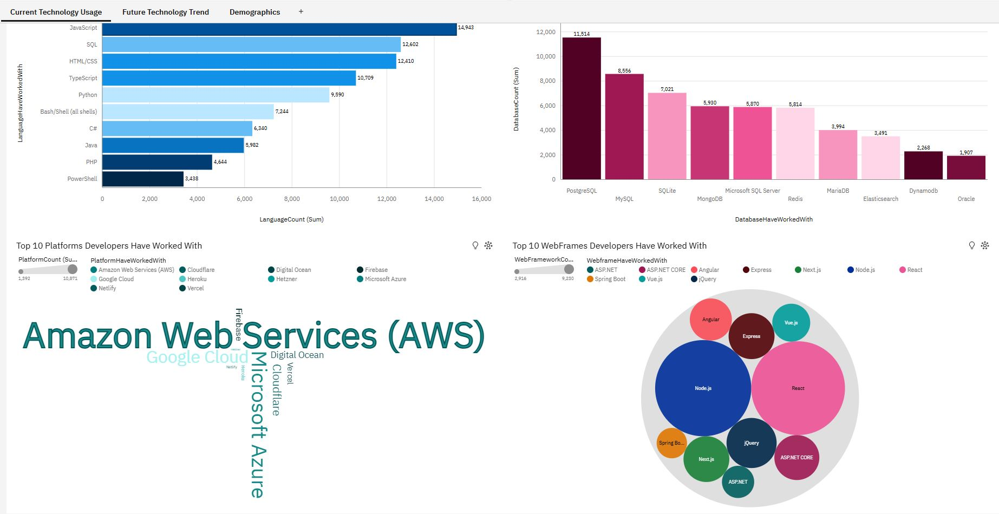
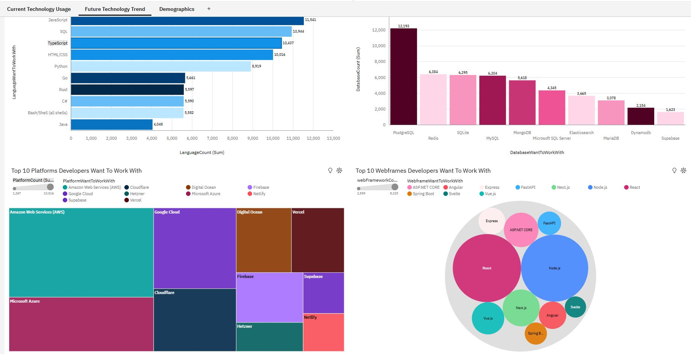
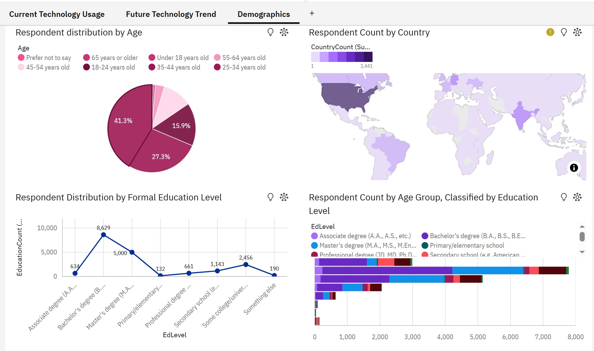

# Stack Overflow Developer Survey Analysis - IBM Capstone

**Author:** Talieh Davani  
**Date:** Feb 2025  
**Certificate:** IBM Data Analyst Capstone

## 📌 Overview
This project explores key insights from the Stack Overflow Developer Survey, analyzing global developer demographics, technology trends, compensation, and job satisfaction. It was completed as a capstone for the IBM Data Analyst Certificate.

## 📊 Key Sections
- Programming Language Trends
- Database Trends

- Salary & Job Satisfaction Analysis
- Regional Developer Insights
- Dashboard Visualizations
- Implications for Developers, Employers, Educators

## 🧠 Key Takeaways
- Python, JavaScript, and SQL dominate, with TypeScript and Rust on the rise.
- Cloud-native tools like Firebase and Snowflake are gaining popularity.
- Younger developers earn less, while mid-career (35–44) earn the most.
- Continuous learning and upskilling are essential for career growth.

## 📸 Dashboard Screenshots

 

## 📊 Key Takeaways from Dashboard Visualizations  

The dashboard visualizations provide **valuable insights** into current technology usage, emerging trends, and the developer demographic landscape.  

### 🚀 Current Technology Usage  
- **Python and JavaScript** dominate among developers.  
- **Cloud services and AI-related technologies** are widely adopted.  
- **SQL-based databases** remain industry standards for structured data management.  

### 🔮 Future Technology Trends  
- **AI & machine learning tools** are gaining traction in development.  
- **Low-code & no-code platforms** are rising, enabling faster development cycles.  
- **Cloud computing and DevOps tools** (e.g., Kubernetes, Terraform) are set for continued growth.  

### 🌍 Developer Demographics  
- **Majority of developers** fall within the **25-34 age group**, with younger professionals rapidly adopting newer tools.  
- **USA, India, and Germany** contribute significantly to the global developer workforce.  
- **Emerging tech hubs** outside traditional markets are accelerating industry growth.  
- **Continuous learning** is key—developers keeping up with **new frameworks** and technologies advance their careers faster.  

### 🏆 Key Insight  
The **tech industry is evolving rapidly**, with developers increasingly **upskilling** in AI, cloud computing, and **modern frameworks** to stay competitive.  

---

## 🔗 Google Colab Notebook  

📄 **Stack Overflow Analysis Colab Notebook**  
- **Filename:** `stack_overflow_analysis_colab.ipynb`  
- **Contents:** Charts, insights, and commentary  

🔍 Access the full notebook here:  
[📄 Open My Colab Notebook](stack_overflow_analysis_colab.ipynb)  

## 📢 Capstone Presentation  

📄 **Capstone Presentation:**  
- **Filename:** `2024-capstone-story-template 2 1.pdf`  
- **Contents:** Key findings, insights, and project summary  

🔍 View my full presentation here:  
[📄 Open Presentation](2024-capstone-story-template%202%201.pdf)  
  

## 📜 Certification  

This project was submitted as the final capstone for IBM’s Data Analyst Professional Certificate.
You can view my certificate here: [Credential URL](https://www.coursera.org/account/accomplishments/specialization/L6TIY98BDKYO)

